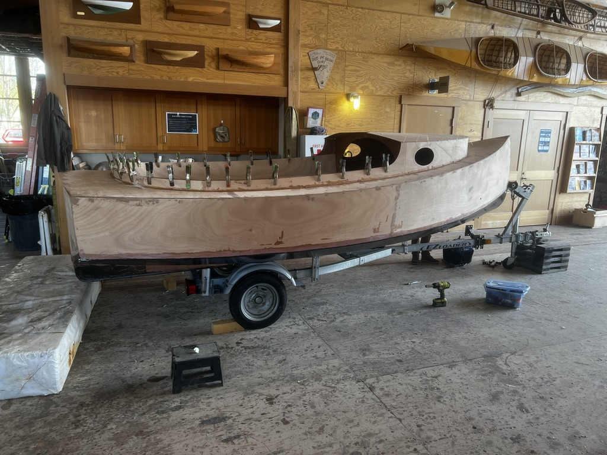

# Old Salt 15 — Remaining Tasks

Last updated: 2026-07-31

This working checklist follows the July 20, 2026 manual where complete, but reflects the actual build order and agreed changes. Checked items are complete. Unchecked items remain or require verification.

Current-state photo taken 2026-04-24. Because the build has been idle for a while, completed work that is not readily visible should be inspected rather than assumed.

## Confirmed starting point

- [x] Chapter 3 substantially completed, subject to the exceptions listed below
- [x] Hull, bulkheads, hull sides, transom, deck, cabin sides, mast trunk, anchor locker, and outboard well assembled
- [x] Bottom fiberglassed, faired, sanded, and coated with graphite-filled epoxy
- [ ] Inspect older completed seams for gaps, voids, epoxy runs, unfairness, or incomplete tape before closing access

## 1. Anchor locker and outboard well — Manual §3.9

- [x] Install bow tube, anchor locker, and outboard well configured for an ePropulsion eLite
- [ ] Inspect the completed assemblies for full sealing, correct drainage, and inaccessible voids
- [ ] Coat the interior of the motor well with graphite-filled epoxy
- [ ] Leave the motor-well slots uncut until a motor is acquired

## 2. Mast trunk and doublers — Manual §3.10

- [x] Laminate and install mast base/step, mast trunk, and Bulkhead 4 doublers
- [ ] Apply the remaining fiberglass tape to the mast step
- [ ] Inspect mast-butt clearance, trunk alignment, fillets, and existing tape before closing access

## 3. Deck — Manual §3.11

- [x] Assemble and install deck and deck doublers
- [ ] Inspect older deck joints and sealed compartments where access remains
- [ ] Confirm all required inaccessible backing plates are installed before finishing the seat tops and cabin

## 4. Cabin, coaming, seats, and cabin top — Manual §§3.12–3.17

### Completed or substantially completed

- [x] Assemble and install cabin sides
- [x] Install centerboard-tank/trunk triplers
- [x] Laminate and install mast block
- [x] Stitch cabin top in position with zip ties
- [x] Dry-fit cockpit coaming

### Coaming

- [ ] Trim and refine the coaming fit
- [ ] Complete seat-locker coating, fillets, tape, and inaccessible finish work before bonding the coaming
- [ ] Epoxy-bond the coaming
- [ ] Apply the remaining coaming fillets and fiberglass tape

### Seat tops and centerboard trunk

- [ ] Inspect and sand the centerboard trunk where needed while access is open
- [ ] Confirm the trunk is straight and the board will not bind
- [ ] Cut any required seat-hatch openings
- [ ] Install both seat tops
- [ ] Apply the specified seat-top fillets and tape

### Cabin top attachment

- [ ] Confirm cabin-top fairness and fit before permanent bonding
- [ ] Epoxy-bond the cabin top between the zip ties
- [ ] Remove the zip ties after cure and fill their holes
- [ ] Apply the remaining cabin-top fillets and fiberglass tape

### Detail cabin top — none completed

- [ ] Install the Bulkhead 3 doubler ring
- [ ] Install the aft cabin-top doublers
- [ ] Rough-cut the toaster-slot opening while preserving the required material near Bulkhead 3
- [ ] Square the mast-trunk and opening edges
- [ ] Fit and bond the toaster-slot edge doubler
- [ ] Trim the toaster slot to its finished shape
- [ ] Install and fillet the portlight doublers
- [ ] Prepare sharp, flat exterior portlight mounting lands
- [ ] Verify mast clearance through the completed opening and trunk

## 5. Final upper-hull laminate — Manual §§4.1–4.2

- [ ] Install, fillet, and fiberglass-tape the cabin-top beams
- [ ] Sand and fair the cockpit sole
- [ ] Fiberglass the cockpit sole
- [ ] Complete cockpit-sole fillets where needed
- [ ] Apply fiberglass tape to the cockpit-sole joints
- [ ] Fill voids and repair incomplete exterior fillets
- [ ] Radius specified exterior and interior corners to at least 1/2 inch
- [ ] Fair deck edges and other long curves
- [ ] Square and epoxy-backfill the coaming lip; no bright trim is planned
- [ ] Apply at least one layer of 6 oz glass to the boat top, including cabin top, decks, and hull sides
- [ ] Maintain at least 1 inch overlap onto existing laminate
- [ ] Apply two epoxy fill coats at the green stage
- [ ] Inspect and repair bubbles, wrinkles, dry glass, and poor overlaps
- [ ] Fair and sand the upper hull, deck, cabin, cockpit, and transom for primer

## 6. Bottom and centerboard trunk — Manual §§4.3–4.7

Most inverted work is complete. No additional rollover is presently planned; remaining items should be completed with the boat upright unless inspection shows that safe access is impossible.

- [x] Shape and fiberglass the bottom, transom, bow, and centerboard-slot opening
- [x] Fair and sand the bottom
- [x] Apply the graphite-filled epoxy bottom coating
- [x] Install and initially fiberglass both skegs
- [x] Return the boat upright
- [ ] Finish the sharp bottom-to-transom release edge
- [ ] Sand and clean up the centerboard trunk where needed
- [ ] Apply one additional layer of fiberglass to each skeg
- [ ] Fair the skegs
- [ ] Apply skeg fill coats
- [ ] Sand the skegs to final bottom-finish condition
- [ ] Inspect prior hard-to-reach interior fillets and tapes; correct only identified omissions

## 7. Primer, paint, nonskid, and stripe — Manual §§4.8–4.9

Scheme: Atlantic Grey and Mediterranean White; no brightwork; white cabin top; grey deck; matte-black graphite bottom; single narrow vinyl boot stripe.

- [ ] Wash cured epoxy as required for possible amine blush
- [ ] Final-fair and verify all wood and glass remain epoxy sealed
- [ ] Confirm the compatible Interlux coating schedule
- [ ] Apply initial Epoxy Primekote coats
- [ ] Fill and fair defects revealed by primer
- [ ] Apply remaining primer and sand to the specified grit
- [ ] Mask and apply Atlantic Grey and Mediterranean White finish coats
- [ ] Apply deck and cockpit nonskid
- [ ] Apply the vinyl boot stripe after sufficient paint cure
- [x] Finish the centerboard and rudder blade
- [ ] Allow full cure before bedding hardware

## 8. Centerboard — Manual §§5.2 and 5.4, modified controls

The finished board is NACA 0012 with three layers of 6 oz glass per side and approximately 12 lb lead. Both controls are 2:1; the revised downhaul runs along the case to a low-friction ring.

- [x] Backfill and form the trailing edge and tip
- [x] Encapsulate the lead and complete the board structure
- [x] Install the Garolite tubes
- [x] Bond the foil halves straight and twist-free
- [x] Apply three layers of 6 oz glass per side
- [x] Fair the NACA profile and finish the trailing edge
- [x] Verify finished thickness and complete the board finish
- [ ] Fabricate pivot bushings and thrust washers
- [ ] Install the pivot and confirm free movement without harmful play
- [ ] Finalize and install the modified 2:1 uphaul and downhaul
- [ ] Use 4 mm Dinghy Control for the first downhaul leg
- [ ] Install a grounding-protection breakaway cleat
- [ ] Cycle the board and correct friction, chafe, or binding
- [ ] Install a serviceable case-access cover

## 9. Rudder, tiller, and transom fittings — Manual §5.3

The rudder blade is finished. The remaining rudder assembly requires fiberglass, a white or gray painted finish, and final assembly. Two Allen A4017-51 pintles and two A4020S gudgeons are on hand. Use bonded G10 backing plates and through-bolts.

- [x] Complete and finish the rudder blade
- [ ] Fiberglass the remaining rudder-head/assembly components, including cheeks, spacer, and tiller as applicable
- [ ] Fair and sand the rudder assembly for paint
- [ ] Select white or gray and paint the rudder assembly
- [ ] Match the finished thickness of rudder, spacer, and tiller
- [ ] Install sealed uphaul and downhaul attachments
- [ ] Install the internal sheave, offset fairleads, CL257 breakaway cleat, and uphaul cleat
- [ ] Assemble the blade, cheeks, spacer, and tiller serviceably
- [ ] Confirm exact pintle/gudgeon/pin geometry before drilling
- [ ] Fabricate and bond G10 backing plates extending at least 1 inch beyond fittings
- [ ] Drill, seal, bed, align, and through-bolt transom fittings
- [ ] Verify tiller clearance through the transom mouse hole
- [ ] Fit the tiller extension and universal joint
- [ ] Verify full movement and reliable grounding release

## 10. Hatches, ports, drainage, and deck hardware

- [ ] Fabricate the main piano-hinged hatch or lid
- [ ] Fit, gasket, latch, bed, and retain all hatches and inspection ports
- [ ] Fit and seal cabin portlights
- [ ] Install hull drain fitting and tethered plug; carry an exact spare
- [ ] Install cockpit drains/scuppers, tubing, and clamps
- [ ] Install and back the bow eye
- [ ] Install and back bow and stern mooring strong points
- [ ] Install secure crew handholds
- [ ] Seal fastener holes through plywood and bed serviceable hardware
- [ ] Isolate dissimilar metals, particularly at the carbon mast

## 11. Traveler and mainsheet — Manual §5.5

Planned: full-width traveler; 6:1 triple/triple mainsheet with 57 mm blocks and ratchet lower block.

- [ ] Fit, curve, drill, seal, bed, and through-bolt the traveler track
- [ ] Install traveler car, end stops, centerline attachment, fairleads, and cam cleats
- [ ] Rig and test the traveler control line
- [ ] Install the upper and lower triple blocks
- [ ] Set the lower cam-cleat angle for use from across the cockpit
- [ ] Reeve the 6:1 mainsheet
- [ ] Confirm 60 feet is adequate before final cutting
- [ ] Verify full trim, ease, and travel without crossing or rubbing

## 12. Mast, sail, and boomless controls

The manual's sail section is incomplete. The boat uses the boomless tanbark Old Salt V-1 sail.

- [ ] Inspect both carbon-mast sections and their joint
- [ ] Dry-step the mast and verify base, trunk, partner, and slot clearances
- [ ] Fit mast-base hardware and partner wedges/bearing/seal
- [ ] Install masthead halyard sheave and halyard exit fitting
- [ ] Install and isolate other mast fittings
- [ ] Measure the internal route and install the 6 mm Alpha SSR halyard
- [ ] Install the contrasting-color 2:1 sail downhaul
- [ ] Confirm sail-delivery attachment hardware
- [ ] Install head, tack/downhaul, and clew/mainsheet attachments
- [ ] Hoist ashore and verify hoist, downhaul range, and sheet geometry
- [ ] Mark useful settings and add mast-entry chafe protection

## 13. Optional asymmetric spinnaker — Later / retrofit

Planned: approximately 160 sq ft asymmetric, approximately 5-foot bowsprit, continuous 7 mm sheets, mainly for light air.

- [ ] Decide whether the spinnaker is in the first-launch scope
- [ ] Cut out the circular spinnaker-chute opening near the bow
- [ ] Fit and epoxy-bond the chute doubler
- [ ] Seal, fillet, tape, and finish the chute opening as required
- [ ] Select and procure a suitable tube for the under-deck retrieval roller; details can remain open until the spinnaker retrofit
- [ ] Fabricate the retrieval roller using the supplied kit end pieces
- [ ] Mount the roller in the shelf area beneath the bow deck so the kite passes smoothly through the chute
- [ ] Trim the lower half of a windsurf mast to serve as the bowsprit socket
- [ ] Fit, align, bond, fillet, tape, and reinforce the bowsprit socket in the bow
- [ ] Confirm the upper windsurf-mast section fits and functions as the removable bowsprit
- [ ] Review bowsprit, tack, masthead, and mast-support loads
- [ ] Install bowsprit supports, bobstay if required, and tack controls
- [ ] Install masthead block, halyard, and retrieval system
- [ ] Install sheet blocks and continuous 7 mm sheets
- [ ] Decide whether running backstays are structurally necessary
- [ ] Conduct a controlled light-air rigging and retrieval test

## 14. Trailer and road transport — Launch critical

- [ ] Fit trailer supports to the finished hull
- [ ] Fit and pad the bow stop and winch stand
- [ ] Install winch strap and independent bow safety restraint
- [ ] Fit two paint-safe transom tie-downs
- [ ] Verify trailer lights and wiring
- [ ] Inspect tires, pressure, age, and lug torque
- [ ] Service wheel bearings and seals; obtain a matched spare
- [ ] Build padded supports and restraints for the two-part carbon mast
- [ ] Verify tongue weight, hull support, clearance, and ramp geometry
- [ ] Perform a short local towing test and recheck restraints

## 15. Safety equipment

### Launch critical

- [ ] Wearable PFDs for everyone aboard
- [ ] Two Onyx Type IV throwable cushions
- [ ] Immediately accessible sound signal
- [ ] Ordered bailer with lanyard
- [ ] Paddle
- [ ] Painter attached to a backed strong point
- [ ] ACR ResQFlare and included daytime distress flag
- [ ] Required drain plugs

### Before regular use

- [ ] Portable manual bilge pump
- [ ] Dedicated tow line
- [ ] Two dock lines and two compact fenders
- [ ] Accessible righting line
- [ ] Waterproof first-aid kit
- [ ] Compact tool-and-spares kit
- [ ] Anchor and rode suited to expected use
- [ ] Secure, capsize-accessible emergency-equipment stowage

## 16. Commissioning and first launch

### Dry commissioning

- [ ] Torque-check and witness-mark critical fasteners
- [ ] Verify all clevis pins, split rings, and retainers
- [ ] Inspect and leak-test penetrations, trunk, well, drain, and bow tube
- [ ] Verify hatch closures and seals
- [ ] Rehearse mast stepping, rigging, and derigging
- [ ] Test centerboard and rudder controls under simulated load
- [ ] Check that control lines cannot foul crew, tiller, or mainsheet
- [ ] Establish capsize recovery, reboarding, and equipment-stowage plans

### First water test

- [ ] Choose sheltered water, light air, recovery help, and little traffic
- [ ] Launch without the spinnaker
- [ ] Check immediately for leaks and verify trim
- [ ] Test centerboard, rudder, sail, downhaul, mainsheet, and traveler
- [ ] Practice depowering the boomless sail
- [ ] Practice capsize recovery and reboarding in controlled conditions
- [ ] Inspect structure, fittings, coatings, and line leads ashore
- [ ] Retorque or adjust hardware and record defects below

## 17. Later / upgrades

- [ ] If a motor is acquired, cut and seal the motor-well slots for the ePropulsion eLite installation
- [ ] Add cup holders, tubing, and nylon ratchet clamps
- [ ] Add a portable all-round anchor light
- [ ] Evaluate an external masthead float
- [ ] Add broader portable navigation lights if night operation is planned
- [ ] Add a breathable fitted cover
- [ ] Evaluate mast sealing plugs compatible with internal halyards
- [ ] Add trailer security
- [ ] Revisit the spinnaker and possible running backstays after initial sailing

## Open decisions and verifications

- [ ] Final rudder-assembly color: white or gray
- [ ] Hidden backing plates before closing deck
- [ ] Hatch and inspection-port sizes and locations
- [ ] Centerboard bushing and thrust-washer dimensions
- [ ] Rudder pintle/gudgeon/pin geometry
- [ ] Final fastener schedule against actual fittings
- [ ] Exact control-line routes and lengths
- [ ] 60-foot mainsheet adequacy for final 6:1 reeving
- [ ] Sail-delivery contents and attachment hardware
- [ ] Spinnaker inclusion in first-launch scope
- [ ] Paint cure before vinyl stripe or hardware bedding

## Defects and corrections

- None recorded yet.
